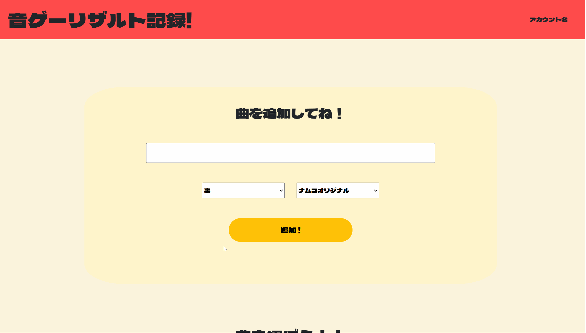
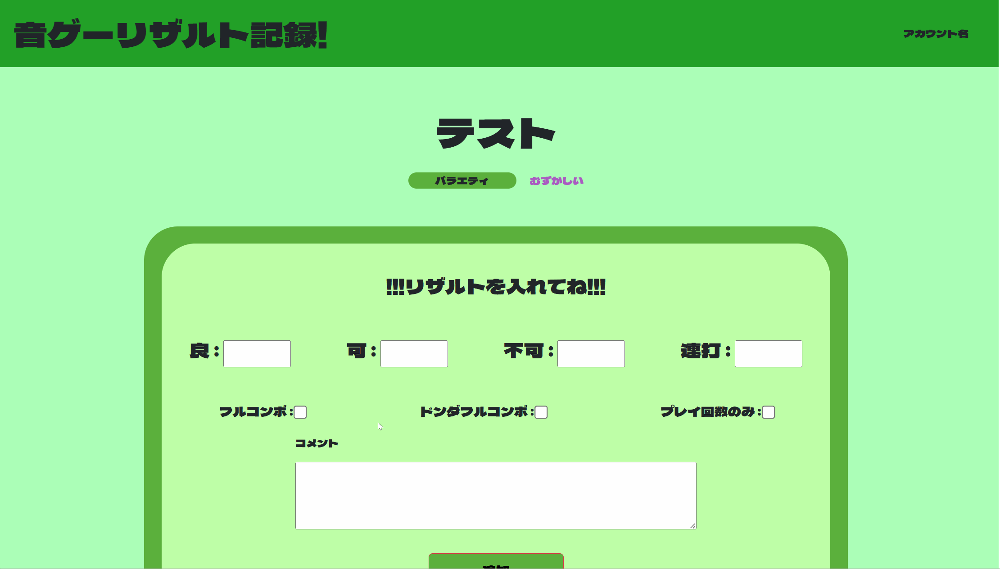

# Taiko Result App
太鼓の達人というリズムゲームのリザルト管理アプリです。
個人で設計・開発を行っており、現在は主に曲やリザルトの登録・表示機能を実装済みです。

------

## 主な機能(2025年7月時点)
- 曲情報の登録(タイトル・ジャンル・難易度)
- 各曲のプレイ結果の記録(良・可・不可・連打数・王冠)
- プレイ回数のみ記録機能
- 記録済みリザルトの一覧表示

------

## 今後の開発予定
- 曲やリザルト情報の編集・削除機能
- 曲やリザルトの検索・並び替え機能
- ログイン機能
- 統計の可視化機能(グラフ化・スコア上昇率など)
- ページング

------

## 使い方
### 曲の追加

### リザルト追加

### プレイ回数のみカウント

-----
## 使用技術
### フロントエンド
- HTML / CSS
- Bootstrap (ボタンやページングなどの簡易なスタイルに使用)
- Bladeテンプレート (Laravel)

### バックエンド
- PHP 8.2.28 (Laravelの実行環境)
- Laravel 12 (アプリケーションフレームワーク)

### データベース
- MySQL (ローカル環境)

### 環境・ツール
- Docker (セットアップ済みの環境で使用中。構成理解は今後の課題)

-----

## 著作権について

本アプリは「太鼓の達人」シリーズをリスペクトした**非公式のファンメイド作品**です。
デザイン・用語等に類似する点がありますが、**公式とは一切関係ありません**。
すべての著作権・商標はそれぞれの権利者に帰属します。
本アプリは**非営利かつ学習目的**で開発しています。
**問題がある場合は即時対応・削除いたします。**

