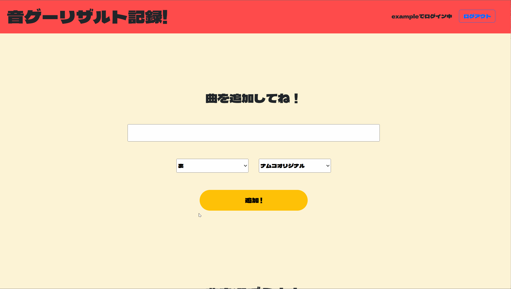
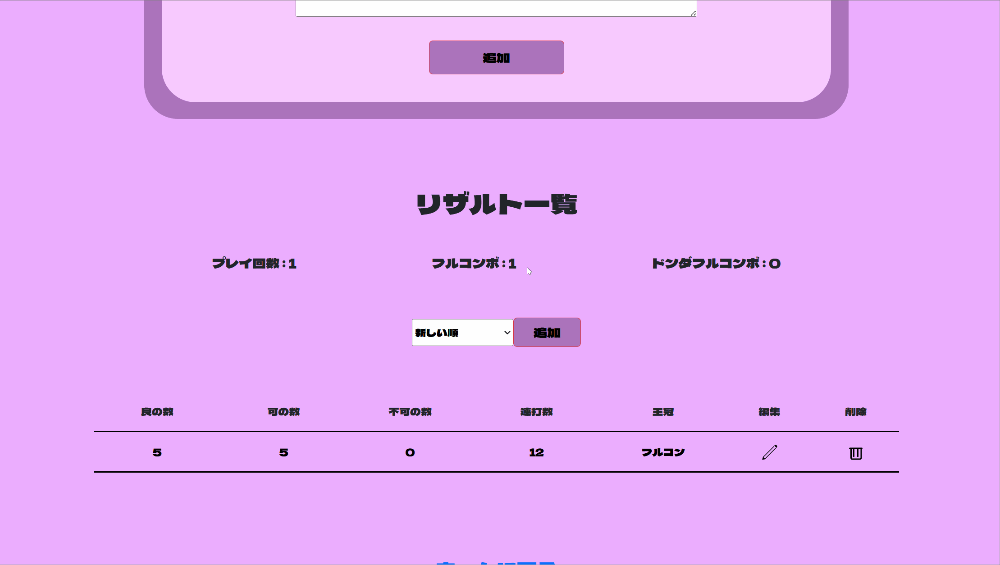
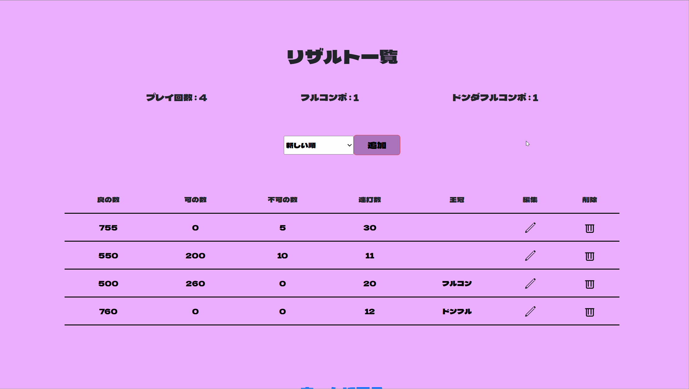
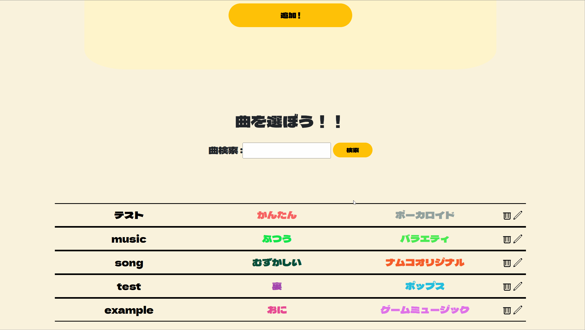
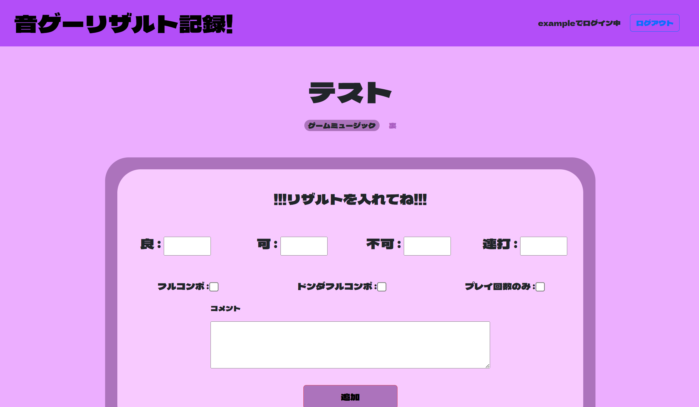
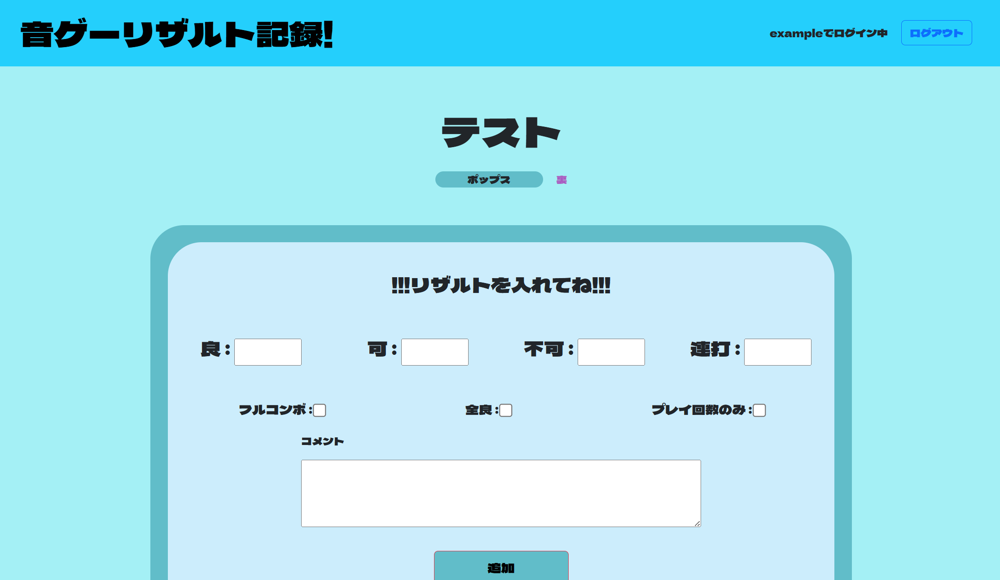
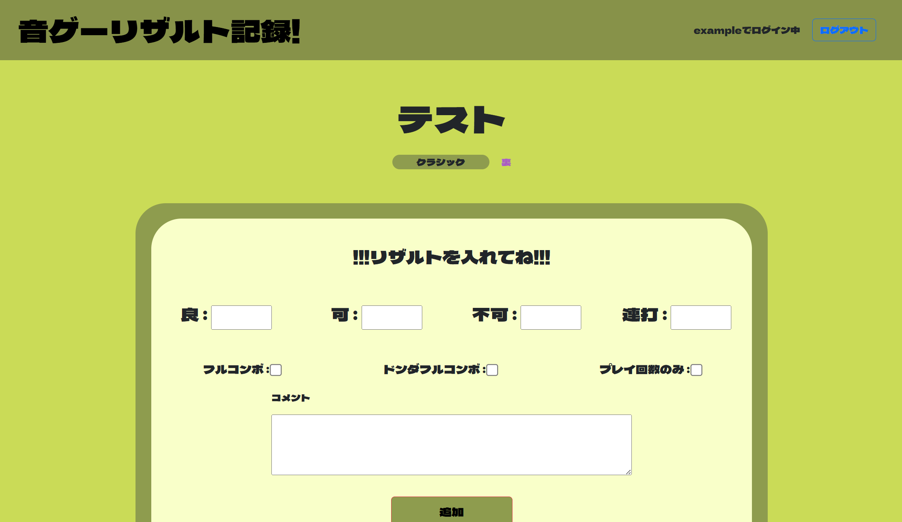
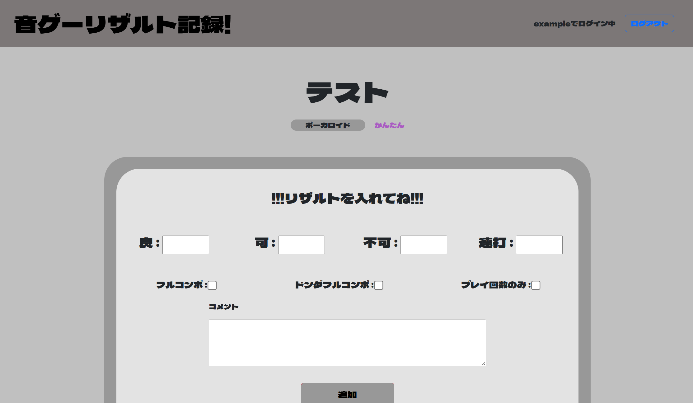
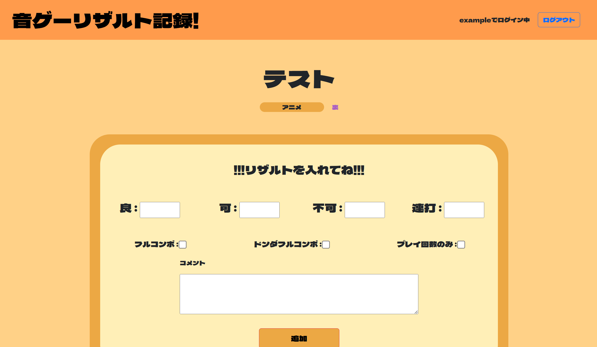

# Taiko Result App
太鼓の達人というリズムゲームのリザルト管理アプリです。
このアプリの一番の魅力は、既存のアプリでは最高記録のみ表示であるところに対して、最高記録以外も含めて閲覧できる点です。
これによりプレイヤーは成長過程を目に見える形で振り返ることができ、上達の実感を得やすくなります。

 

------

## サービスの概要
このアプリは、リズムゲーム「太鼓の達人」のリザルトを記録・管理できるアプリです。
曲をジャンルや難易度と合わせて登録すると、自動的にフォルダが作成され、曲ごとにリザルトを保存できます。
さらにプレイ回数やフルコンボ回数なども自動でカウントされるため、自分のプレイ履歴を振り返りやすくなっています。 
また、リザルトの並び替え機能を搭載しており、判定順や登録日順など目的に合わせて簡単に切り替えることが出来ます。
そのため、上達を目指す人や、後からプレイ記録を見返して分析したり、自分の成長過程を実感したい人に特におすすめです。

 

------

## 開発した背景
私は休日によくリズムゲーム「太鼓の達人」をプレイしており、目標を立てて挑戦を続けています。
しかし既存の記録アプリでは最高記録しか残らないため、過去のプレイを振り返ったり、成長を実感したりすることが難しいと感じていました。
そこで、自分自身の成長を振り返られるように、そして友人や他プレイヤーの上達をサポートできるように、このアプリを開発しました。

 

-----

## 主な機能(2025年9月時点)
- ユーザー登録、ログイン機能
- 曲情報の登録(タイトル・ジャンル・難易度)
- 曲一覧の表示機能
- 登録済みの曲の検索機能
- 各曲のプレイ結果の記録(良・可・不可・連打数・王冠・コメント)
- プレイ回数のみ記録機能
- 記録済みリザルトの一覧表示
- 各リザルト詳細情報閲覧機能
- リザルト並び替え機能
- ページネーション機能(リザルト)
- 曲やリザルト情報の編集・削除機能
- レスポンシブ対応

 

------

## 使い方
ログインをすることで、主に以下のような機能を利用することが出来ます。
| 基本的な使い方 | 編集・削除 |
| --------------------| --------------------|    
|  |  |
| 曲情報を入力後、リザルト画面に移動し、登録曲ごとにリザルトを追加することが出来ます。 | リザルトを編集削除することが出来ます。曲情報についても編集可能です。 |

###
| プレイ回数のみ記録 | 検索・並び替え |
| --------------------| --------------------|
|  |  |
| プレイ回数のみチェックボックスをチェックし送信することで、他情報を入力せずにプレイ回数をカウントすることが出来ます。 | 曲の検索やリザルトの並び替えをすることが出来ます。 |

  

-----

## UIの工夫
曲のジャンルに応じて、曲の詳細画面の背景色が自動的に切り替わるようになっています。
| ナムコオリジナル | ゲームミュージック |
| --------------------| --------------------|
|  |  |

| ポップス | クラシック |
| --------------------| --------------------|
|  |  |

| ボーカロイド | アニメ |
| --------------------| --------------------|
|  |  |

 

------

## 今後の開発予定
- 統計の可視化機能(グラフ化・スコア上昇率など)
- リザルト固定表示機能(ピン止め機能)

 

-----

## 使用技術
### フロントエンド
- HTML / CSS
- Bootstrap (ボタンやページングなどの簡易なスタイルに使用)
- Bladeテンプレート (Laravel)

### バックエンド
- PHP 8.2.28 (Laravelの実行環境)
- Laravel 12 (アプリケーションフレームワーク)

### データベース
- MySQL (ローカル環境)

### 環境・ツール
- Docker (セットアップ済みの環境で使用中。構成理解は今後の課題)

-----

## 著作権について

本アプリは「太鼓の達人」シリーズをリスペクトした**非公式のファンメイド作品**です。
デザイン・用語等に類似する点がありますが、**公式とは一切関係ありません**。
すべての著作権・商標はそれぞれの権利者に帰属します。
本アプリは**非営利かつ学習目的**で開発しています。
**問題がある場合は即時対応・削除いたします。**

