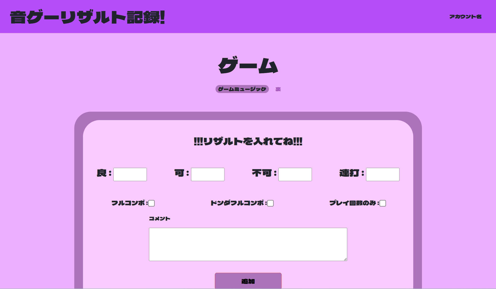

# Taiko Result App
太鼓の達人というリズムゲームのリザルト管理アプリです。
このアプリの一番の魅力は、既存のアプリでは最高記録のみ表示であるところに対して、最高記録以外も含めて閲覧できる点です。
これによりプレイヤーは成長過程を目に見える形で振り返ることができ、上達の実感を得やすくなります。

------

## 主な機能(2025年9月時点)
- ユーザー登録、ログイン機能
- 曲情報の登録(タイトル・ジャンル・難易度)
- 曲一覧の表示機能
- 登録済みの曲の検索機能
- 各曲のプレイ結果の記録(良・可・不可・連打数・王冠・コメント)
- プレイ回数のみ記録機能
- 記録済みリザルトの一覧表示
- 各リザルト詳細情報閲覧機能
- リザルト並び替え機能
- ページネーション機能(リザルト)
- 曲やリザルト情報の編集・削除機能
- レスポンシブ対応

------

## 今後の開発予定
- 統計の可視化機能(グラフ化・スコア上昇率など)
- リザルト固定表示機能(ピン止め機能)

------

## 使い方
### 曲の追加

### リザルト追加

### プレイ回数のみカウント

-----

## UIの工夫
曲のジャンルに応じて、曲の詳細画面の背景色が自動的に切り替わるようになっています。
以下はジャンル別の表示例です。

### ゲームミュージックジャンルの背景

### アニメジャンルの背景

-----

## 使用技術
### フロントエンド
- HTML / CSS
- Bootstrap (ボタンやページングなどの簡易なスタイルに使用)
- Bladeテンプレート (Laravel)

### バックエンド
- PHP 8.2.28 (Laravelの実行環境)
- Laravel 12 (アプリケーションフレームワーク)

### データベース
- MySQL (ローカル環境)

### 環境・ツール
- Docker (セットアップ済みの環境で使用中。構成理解は今後の課題)

-----

## 著作権について

本アプリは「太鼓の達人」シリーズをリスペクトした**非公式のファンメイド作品**です。
デザイン・用語等に類似する点がありますが、**公式とは一切関係ありません**。
すべての著作権・商標はそれぞれの権利者に帰属します。
本アプリは**非営利かつ学習目的**で開発しています。
**問題がある場合は即時対応・削除いたします。**

